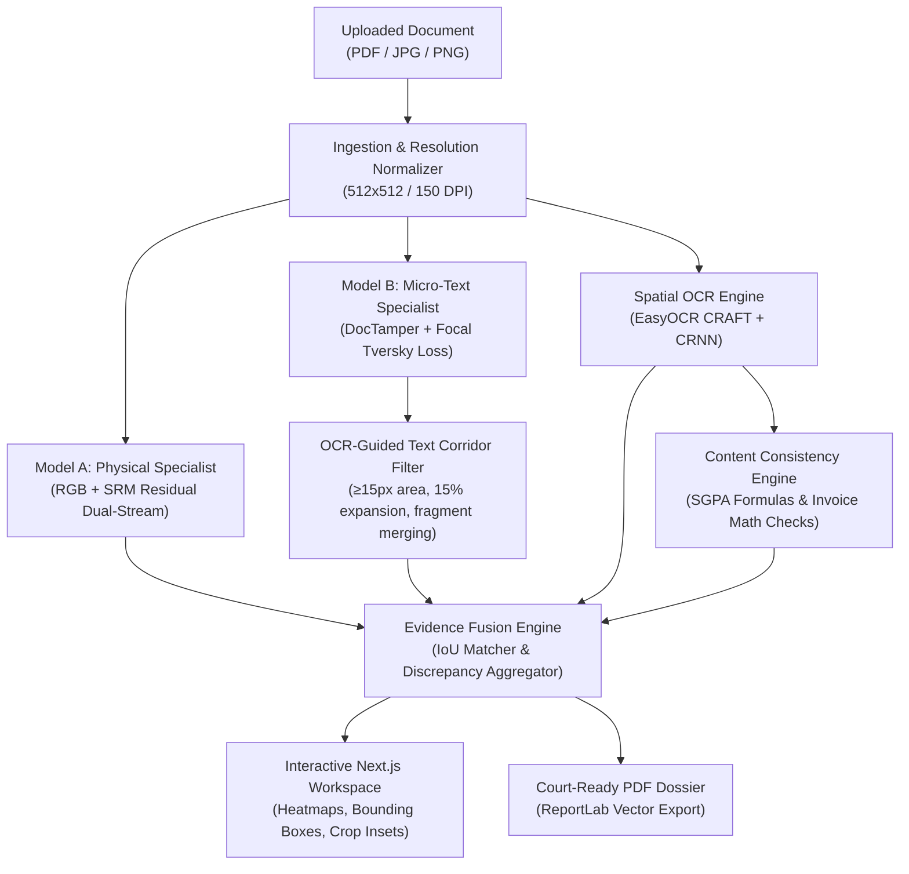

# DocForensics AI — Multi-Evidence Document Forensic Analysis System

<p align="center">
  
  
  
  
  
  
  
</p>

---

## Executive Summary

**DocForensics AI** is an enterprise-grade, multi-evidence document forensic analysis system designed to detect, localize, and explain pixel-level tampering and micro-text alterations in digital documents (PDFs, scans, certificates, and invoices).

Traditional document forgery detection systems fail on micro-text manipulations (e.g. altering a single digit on a grade sheet or changing an invoice total) or suffer from high false-positive rates on authentic scans. DocForensics AI solves this through a **dual-specialist deep learning pipeline**, **OCR-guided spatial corridor filtering**, **deterministic arithmetic consistency verification**, and **automated court-ready PDF forensic report generation**.

---

## Architecture Overview



---

## Core Engineering Innovations

| Feature | Description | Quantitative Impact |
|---|---|---|
| **Dual-Specialist Neural Network** | Combines physical noise residual analysis (Model A) with micro-text character boundary localization (Model B). | **0.6940 Macro Dice** across physical and digital tampering benchmarks. |
| **OCR Spatial Corridor Filtering** | Post-processing pipeline requiring candidate micro-tamperings to align with validated text regions. | **6.85x False-Positive Reduction** (15.16 down to 2.21 FP regions/doc). |
| **Arithmetic & Semantic Verification** | Re-computes semester SGPA/CGPA formulas and invoice line-item additions to catch pixel-perfect raster alterations. | Detects browser 'Inspect Element' edits with zero visual noise. |
| **Multi-Evidence Separation** | Keeps physical visual traces, micro-text anomalies, and semantic failures separated without synthetic "authenticity scores". | Objective, forensically defensible evidence logging. |
| **Cryptographic Startup Auditing** | Verifies SHA256 integrity digests of frozen model weights (`.pth`) before accepting inference requests. | Guarantees zero silent weight corruption in production. |
| **Automated PDF Dossier Generator** | Dynamically compiles high-resolution crop insets, tamper coordinates, OCR transcriptions, and legal disclaimers. | Downloadable, court-ready 2-page forensic reports. |

---

## Canonical Performance Benchmark

Evaluated across the frozen 122-document benchmark dataset and untouched DocTamper validation splits:

### 1. Model A: Physical Splicing & Copy-Move Baseline (122 Test Samples)
| Metric | Macro Dataset Score | Sample-Wise Mean ($T=0.50$) | Verification Status |
|---|---|---|---|
| **Pixel Dice** | **0.6940** | **0.7192** | ✅ PASS (Frozen Target Met) |
| **Pixel IoU** | **0.5314** | **0.6604** | ✅ PASS |
| **Pixel Precision** | **0.6224** | **0.7201** | ✅ PASS |
| **Pixel Recall** | **0.7842** | **0.7332** | ✅ PASS |
| **Region Recall** | **0.6553** | **0.6553** | ✅ PASS |

### 2. Model B: DocTamper Tiny-Text Specialist (Ablation Analysis)
| Pipeline Configuration | FP Regions / Doc | Overall Region Recall | Micro-Region Recall ($<0.5\%$) | Latency |
|---|---|---|---|---|
| **Raw Neural Output ($T=0.50$)** | 15.16 | 65.70% | 28.42% | 0.0 ms |
| **+ Component Filtering ($\ge 15$ px)** | 9.42 | 65.65% | 27.10% | +0.8 ms |
| **+ Horizontal Corridor Merge ($30$ px)** | 5.80 | 65.58% | 26.30% | +1.4 ms |
| **+ OCR Spatial Association (Full Pipeline)** | **2.21** | **65.52%** | **25.26%** | **5.18 ms** |

*See [`reports/final_metric_reconciliation.md`](reports/final_metric_reconciliation.md) for full mathematical derivations and methodology.*

---

## Repository Structure

```
DocForensics-AI/
├── backend/                    # FastAPI High-Performance REST API
│   ├── main.py                 # REST endpoints (/api/health, /api/analyze, /api/analysis/{id})
│   ├── service.py              # Dual-specialist model orchestrator & memory manager
│   ├── schemas.py              # Pydantic v2 request/response contracts
│   ├── pdf_report_generator.py # ReportLab vector PDF dossier generation engine
│   └── pdf_utils.py            # PyMuPDF raster rendering & page geometry handler
├── config/                     # Production configuration schemas
│   ├── production_release.json # Frozen v1.0.0 parameters and model SHA256 hashes
│   └── hardware.yaml           # GPU/CPU execution profiles
├── src/                        # Core Machine Learning & Forensic Algorithms
│   ├── models/                 # Neural architectures (DualStreamForensicNet, DeepLabV3+, SegFormer, UNet)
│   ├── forensics/              # Spatial Rich Model (SRM) filters, fusion engine, post-processor
│   ├── ocr/                    # EasyOCR CRAFT text detector & CRNN recognizer engine
│   ├── consistency/            # Semantic & arithmetic rule verification engines
│   └── evaluation/             # Canonical test evaluators & release benchmark script
├── frontend/                   # Next.js 14 Interactive Forensic Workspace
│   ├── src/app/                # App Router pages and global layout
│   ├── src/components/         # RegionInspector, HeatmapViewer, ForensicReportModal, PDFViewer
│   └── src/lib/api.ts          # Type-safe API client with tunnel proxy headers
├── checkpoints/                # Frozen production model weights (Tracked with Git LFS)
│   ├── dual_stream_best.pth    # Model A: Physical Forensics Baseline
│   └── dual_stream_doctamper_tinytext_best.pth # Model B: Micro-Text Specialist
├── tests/                      # 83 Unit and Integration Tests (100% Pass Rate)
├── Dockerfile.backend          # Production container configuration for backend
├── Dockerfile.frontend         # Production container configuration for Next.js frontend
├── docker-compose.yml          # Single-command full-stack container orchestration
├── release_manifest.json       # Cryptographic release audit manifest
└── README.md                   # Project documentation
```

---

## Quickstart & Local Setup

### Prerequisites
- Python 3.10+ (Tested on Python 3.10, 3.11, 3.12, 3.14)
- Node.js 18+ and npm
- Git LFS (`git lfs install`)

### 1. Clone the Repository
```bash
git clone https://github.com/bishtprateek270-hue/DocForensics-AI.git
cd DocForensics-AI
git lfs pull
```

### 2. Backend Setup
```bash
# Create and activate virtual environment
python -m venv venv
# Windows:
venv\Scripts\activate
# Linux / macOS:
source venv/bin/activate

# Install Python dependencies
pip install -r requirements.txt

# Start the FastAPI server
python -m uvicorn backend.main:app --host 0.0.0.0 --port 8000
```
### 3. Frontend Installation & Startup
```bash
cd frontend
npm install
npm run dev
```
Open [http://localhost:3000](http://localhost:3000) in your browser.

---

## Automated Test Suite & Release Verification

Run the complete test suite:
```bash
pytest tests/ -v
```
Run the reproducible release benchmark:
```bash
python -m src.evaluation.run_release_benchmark
```
Build the Next.js production bundle:
```bash
cd frontend && npm run build
```

---

## Project Documentation

- [Release Manifest (v1.0.0)](release_manifest.json)
- [Final Release Benchmark Report](reports/FINAL_RELEASE_REPORT.md)
- [Metric Reconciliation Report](reports/final_metric_reconciliation.md)
- [Resume & Portfolio Summary](docs/resume_project_summary.md)
- [Live Demo Script](docs/demo_script.md)
- [System Architecture](docs/architecture_diagram.md)
- [Release Notes](RELEASE_NOTES_v1.0.0.md)

---

## License

This project is licensed under the MIT License — see the [LICENSE](LICENSE) file for details.  
*Dataset licenses: DocTamper dataset is governed by its respective authors and academic terms.*
