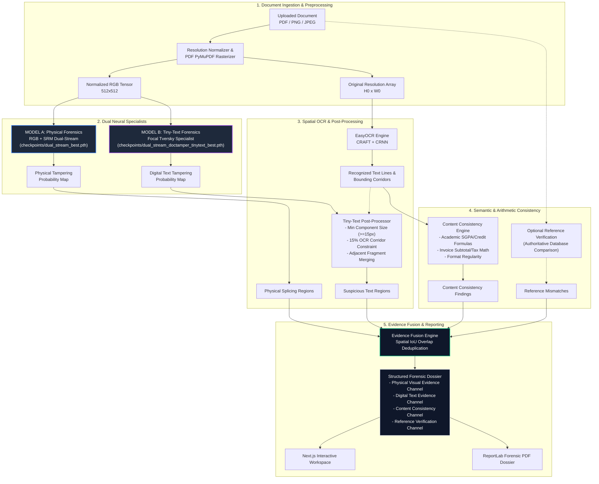

# DocForensics AI — System Architecture

---

## Data Flow Summary

1. **Ingestion:** Supports PNG, JPEG, and multi-page PDF documents. All pages are rasterized and normalized to $512 \times 512$ ImageNet-standard tensors while maintaining full original resolution coordinates.
2. **Dual Inference:** Model A (physical splicing, signature/photo copy-move, stamps) and Model B (micro-text and numerical alterations) execute concurrently in GPU inference mode.
3. **OCR-Aware Suppression:** EasyOCR extracts bounding boxes around text tokens; Model B predictions outside expanded text corridors or below 15 pixels are suppressed, reducing false-positive regions by 6.85x.
4. **Consistency Evaluation:** Deterministic rule engines recalculate arithmetic and semester GPA formulas to catch pixel-perfect Inspect-Element edits.
5. **Channelized Fusion:** Detections are structured into separated channels without synthetic probability averaging, generating both web workspace interactions and authoritative PDF dossiers.
